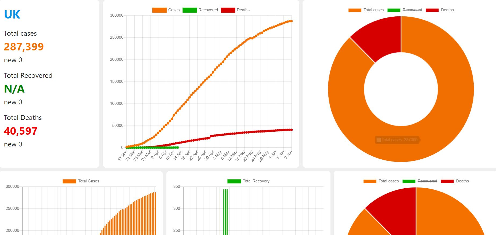

## Covid 19 stats

## Aboout the project
This is my first big project in web development.I worked on this as a final project while This project is about collecting real time Covid 19 statistics and ploting the stats on HTML canvas as charts.

# 1. Setup
In order to use this project, you will need two things: a GitHub Fork and a local clone of this project.

### 1 - Fork a Source Repository
Fork the source repository:
   1. Click the "fork" button, and choose your personal GitHub account if prompted.

### 2 - Clone your Fork
Clone this project to your local machine and change working directory to the cloned repository.

## Process
The process begins by fetching data using from 

